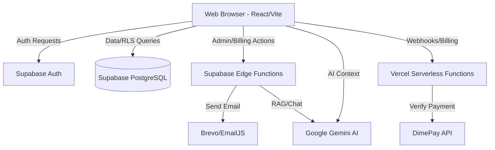

# System Architecture: Payroll-Jam

## 1. High-Level Diagram (Conceptual)

## 2. Major Layers

### 2.1 Frontend (SPA)
- **State Management**: App-shell state is split across focused app and feature modules rather than a monolithic `App.tsx`.
    - `src/app/useAppNavigation.ts`
    - `src/app/useAuthRedirects.ts`
    - `src/app/useAppBootstrap.ts`
    - `src/app/useAppData.ts`
    - `src/features/company/useCompanyConfigData.ts`
    - `src/features/employees/useWorkforceData.ts`
    - `src/features/payroll/usePayrollData.ts`
- **Navigation**: Typed route parsing and mutation live in `src/app/routes.ts` and `src/app/useAppNavigation.ts`.
- **Shell Composition**: `src/App.tsx` selects between `src/app/PublicApp.tsx` and `src/app/AuthenticatedApp.tsx`.
- **Styling**: Tailwind CSS with a consistent theme defined in `tailwind.config.js`.

### 2.2 Data Access Layer
- Focused services own the main persistence boundaries:
    - `src/services/CompanyService.ts`
    - `src/services/EmployeeService.ts`
    - `src/services/PayrollService.ts`
    - `src/services/BillingService.ts`
    - `src/services/ResellerService.ts`
    - `src/services/UserService.ts`
    - `src/services/AuditService.ts`
- `src/services/supabaseService.ts` is a compatibility façade, not the intended entry point for new code.

**Security Boundary** ✅: All `getServiceRoleClient()` calls have been removed from frontend code. Operations requiring `SUPABASE_SERVICE_ROLE_KEY` are exclusively handled by the `admin-handler` Edge Function. Zero references to `SERVICE_ROLE` remain in `/src`.

**Global Config** ✅: `global_config` (single `platform` row) is the authoritative source for platform-wide settings (pricing plans, payment gateway config, system banners). `CompanyService.getGlobalConfig` and `saveGlobalConfig` read and write only this table. The historical fallback that read/wrote config via `companies.settings.globalConfig` has been removed (2026-04-23).

**Billing Aggregation** ✅: MRR, ARR, revenue totals, and chart data are computed server-side by the `get-billing-stats` admin-handler action. `BillingService.getBillingStats(filter)` is the client entry point. Raw `getAllSubscriptions` / `getAllPayments` remain available for per-company views but should not be used for platform-wide aggregation.

### 2.3 Business Logic (The "Payroll Engine")
- **`utils/taxUtils.ts`**: Source of truth for all NIS, NHT, ED TAX, and PAYE math.
- **`hooks/usePayroll.ts`**: Manages the state and lifecycle of a specific Pay Run period.
- **Feature Hooks**: Workforce, payroll, and company configuration persistence live closer to their domains.

### 2.4 Serverless Logic (Edge Functions)

All edge functions live under `supabase/functions/`.

| Function | Responsibility |
|---|---|
| `admin-handler` | All privileged operations: tenant CRUD, user management, reseller portfolio sync, audit logs, platform stats, billing aggregation. RLS-bypassed via service role. |
| `payroll-chat` | AI chat grounding — retrieves company context from DB, pipes to Gemini. |
| `send-email` | Transactional email dispatch via Brevo/EmailJS. |

**Vercel Functions** (`api/`) handle incoming DimePay webhooks and card-payment events.

#### admin-handler Query Budget

Each action is designed to issue a bounded number of DB queries regardless of tenant count:

| Action | Query count | Notes |
|---|---|---|
| `get-all-companies` | 3 | Page query + batch owner lookup + `get_company_employee_counts` RPC |
| `get-platform-stats` | 5 (parallel) | Counts + live subscriptions for MRR |
| `get-billing-stats` | 2 (parallel) | Subscriptions + filtered payment_history |
| `sync-reseller-portfolio` | 3 | Members + batch `reseller_clients` upsert + batch `companies` update |

## 3. Data Flow

### 3.0 App Shell Boot Flow
1. `src/App.tsx` reads auth state and route state.
2. `src/app/useAppNavigation.ts` resolves the active app route from the URL.
3. `src/app/useAuthRedirects.ts` handles invite tokens, expired verification links, and auth-page redirects.
4. `src/app/useAppBootstrap.ts` hydrates company, workforce, payroll, and account data.
5. `src/app/AuthenticatedApp.tsx` or `src/app/PublicApp.tsx` renders the correct shell.

### 3.1 Payroll Processing Flow
1. **Input**: User selects a pay cycle (Weekly/Monthly) and period.
2. **Expansion**: Bootstrap hooks fetch active employees and applicable leave/timesheets.
3. **Calculation**: `taxUtils` applies Jamaican 2026 tax rules to each line item.
4. **Validation**: User reviews calculations, applies manual overrides.
5. **Persistence**: Pay runs are saved through focused payroll services and feature state hooks.

### 3.2 AI Assistant Flow
1. **Request**: User asks a question to JamBot.
2. **Grounding**: Client calls `payroll-chat` Edge Function.
3. **Processing**: Edge Function retrieves relevant context from the DB and pipes it to Gemini 1.5 Flash.
4. **Response**: Formatted markdown response returned to the UI.

### 3.3 Global Config Flow
1. On mount, `useCompanyConfigData` calls `CompanyService.getGlobalConfig()`.
2. Reads `global_config WHERE id = 'platform'` (single row, single query).
3. On write, `CompanyService.saveGlobalConfig()` upserts to `global_config` only.
4. `src/services/updateGlobalConfig.ts` wraps this for partial-update callers.

### 3.4 Admin Billing Aggregation Flow
1. SuperAdmin billing tab calls `BillingService.getBillingStats(filter)`.
2. `getBillingStats` invokes `admin-handler` with action `get-billing-stats`.
3. Edge function queries `subscriptions` (MRR) and `payment_history` (revenue chart) server-side.
4. Returns pre-aggregated `billingStats` object + `revenueData` array — no raw records sent to the browser.

## 4. Key Dependencies
- `@supabase/supabase-js`: Database and Auth.
- `@google/generative-ai`: Client-side AI interactions.
- `recharts`: Financial and compliance visualization.
- `sonner`: User feedback and notifications.
- `papaparse`: Bulk employee imports via CSV.
- `vitest` + `jsdom`: App-layer route and hook validation.

## 5. Database Schema Notes

The canonical schema lives in `db/schema.sql` (append-only migration log). New migrations go in `db/migrations/` with a `YYYYMMDD_` prefix.

| Table | Owner | Notes |
|---|---|---|
| `companies` | Backend | `email`, `phone`, `billing_cycle`, `employee_limit` added 2026-04-23 (migration `20260423_companies_columns`). Previously these lived only in `settings` JSONB. |
| `global_config` | Backend | Single `platform` row. Authoritative for all platform config since schema.sql seed. |
| `subscriptions` | Backend | `billing_frequency` + `amount` drive live MRR calculation. Do not cache MRR in `companies.settings`. |
| `payment_history` | Backend | Filtered server-side for billing stats. `status = 'completed'` is the authoritative revenue set. |

### RPC Functions
| Function | Purpose |
|---|---|
| `get_company_employee_counts(UUID[])` | Batched employee count per company. Used by `get-all-companies` to avoid N+1. Added 2026-04-23. |

## 6. Current Quality Snapshot
- `App.tsx` is a small composition root.
- Public and authenticated shells are separated.
- Company, workforce, and payroll state are owned closer to their domains.
- Route parsing, app navigation, auth redirects, and app-flow handlers have direct automated coverage.
- **Security**: All service-role operations migrated to Edge Functions (completed 2026-04-22).
- **Type Safety**: Reduced from 223 → 151 `any` usages (32% reduction, 2026-04-22). DB row types and coercion helpers added to `core/types.ts`. Services layer at 28 remaining (70% reduction).
- **Backend Consistency** (2026-04-23): Global config single source of truth enforced; N+1 queries eliminated from `get-all-companies` and `sync-reseller-portfolio`; billing aggregation moved server-side; schema mismatch fallbacks replaced with explicit migrations.
- Remaining architectural debt: custom `?page=` router (functional and typed but not a framework router); `SuperAdmin.tsx` billing tab still calls raw `BillingService.getAllSubscriptions/getAllPayments` — should be migrated to `BillingService.getBillingStats`.
