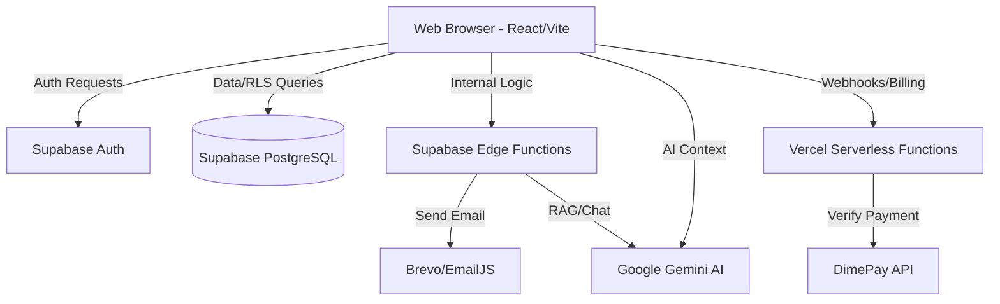

# System Architecture: Payroll-Jam

## 1. High-Level Diagram (Conceptual)

## 2. Major Layers

### 2.1 Frontend (SPA)
- **State Management**: React `useState`/`useEffect` hooks, centralized in `App.tsx` (Current) and specialized hooks like `usePayroll` and `useAccount`.
- **Navigation**: Custom routing logic in `App.tsx` using URL path state.
- **Styling**: Tailwind CSS with a consistent theme defined in `tailwind.config.js`.

### 2.2 Data Access Layer (`services/supabaseService.ts`)
- A centralized (monolithic) provider for all Supabase interactions.
- Handles CRUD for Companies, Employees, Pay Runs, etc.
- **Security Check**: Periodically utilizes `getAdminClient` (Service Role) which must be carefully guarded.

### 2.3 Business Logic (The "Payroll Engine")
- **`utils/taxUtils.ts`**: The source of truth for all math related to NIS, NHT, ED TAX, and PAYE.
- **`hooks/usePayroll.ts`**: Manages the state and lifecycle of a specific Pay Run period.

### 2.4 Serverless Logic
- **Supabase Edge Functions**: Process payslip generation, AI chat grounding, and email dispatch.
- **Vercel Functions**: Handle webhooks from DimePay and sensitive billing operations.

## 3. Data Flow

### 3.1 Payroll Processing Flow
1. **Input**: User selects a pay cycle (Weekly/Monthly) and period.
2. **Expansion**: `usePayroll` fetches active employees and applicable leave/timesheets.
3. **Calculation**: `taxUtils` applies Jamaican 2026 tax rules to each line item.
4. **Validation**: User reviews calculations in the UI, potentially applying manual overrides.
5. **Persistence**: Large JSON blob representing the `PayRun` is saved via `supabaseService`.

### 3.2 AI Assistant Flow
1. **Request**: User asks a question to JamBot.
2. **Grounding**: Client calls `payroll-chat` Edge Function.
3. **Processing**: Edge Function retrieves relevant context from the DB and pipes it to Gemini 1.5 Flash with a system prompt.
4. **Response**: Formatted markdown response returned to the UI.

## 4. Key Dependencies
- `@supabase/supabase-js`: Database and Auth.
- `@google/generative-ai`: Client-side AI interactions.
- `recharts`: Financial and compliance visualization.
- `sonner`: User feedback and notifications.
- `papaparse`: Bulk employee imports via CSV.
